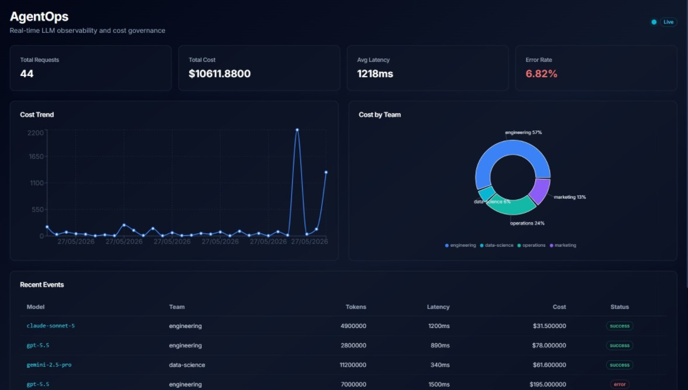
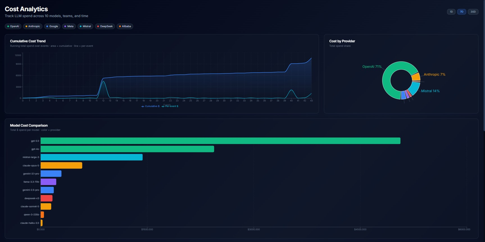
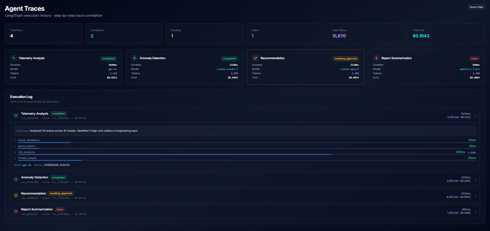
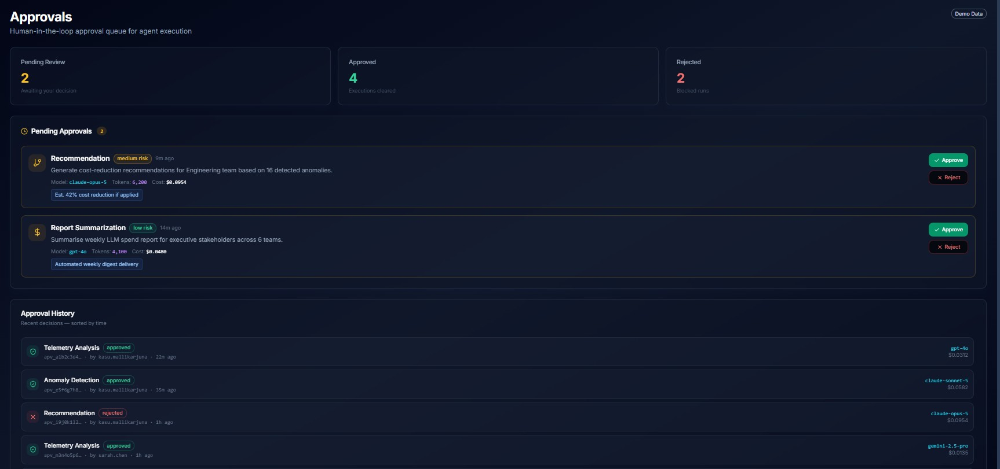
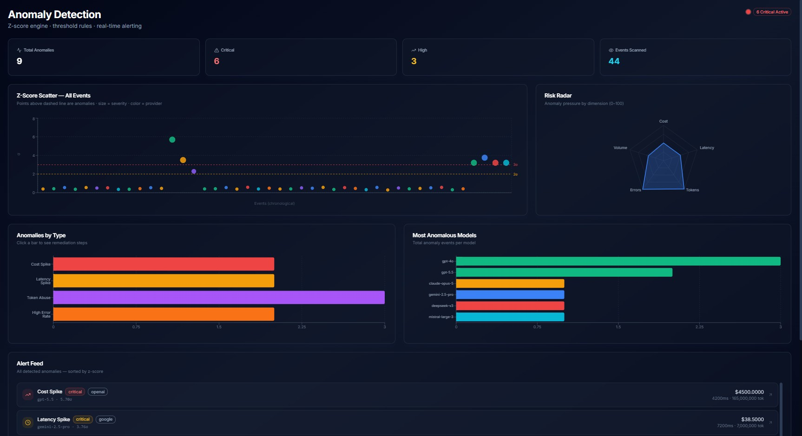
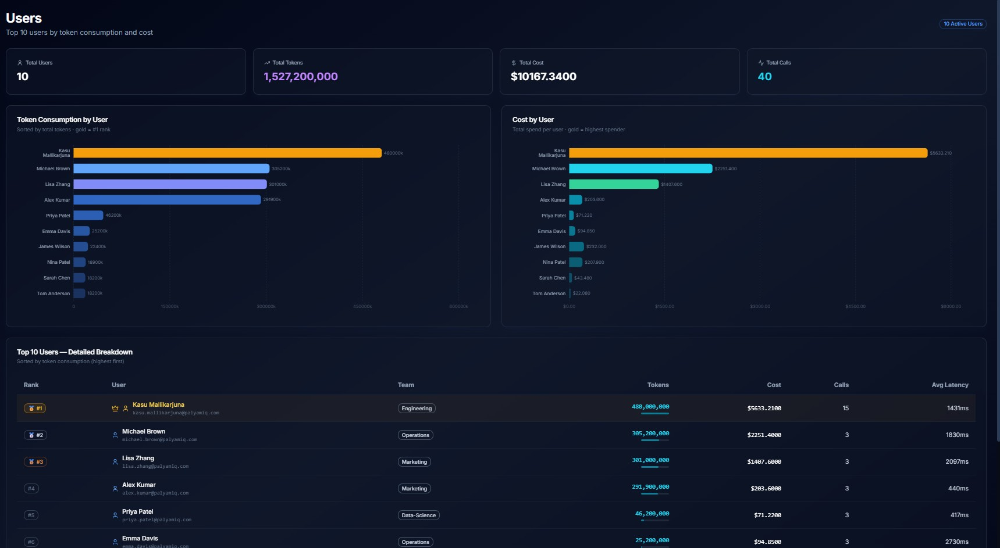
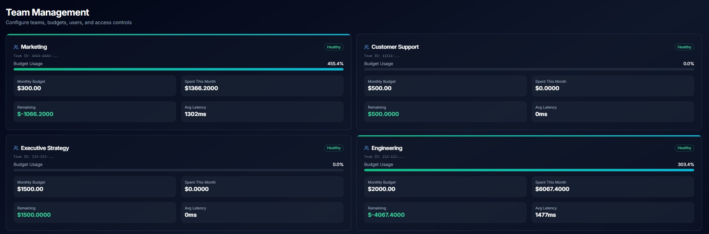

# Palyam IQ AgentOps

**Enterprise LLM Cost Governance Platform**

Multi-team LLM cost governance with approval-gated agent execution, real-time budget tracking, anomaly detection, and full execution traceability across 10 models and 7 providers.

---

## The Problem

Enterprise teams share LLM API keys without spend controls.

- Team A runs a \$55 analysis job.
- Team B runs a 120M-token batch overnight — \$4,500 in a single call.
- Finance sees the bill Monday morning with zero attribution.

No guardrails. No accountability. No early warning.

---

## The Solution

| Feature | Outcome |
|---|---|
| **Per-Team Budgets** | Each team has a monthly cost ceiling with real-time burn tracking |
| **Approval Gates** | Over-budget or high-risk requests require explicit human approval before execution |
| **Z-Score Anomaly Detection** | Automatically flags cost spikes, latency spikes, token abuse, and high error rates |
| **Execution Tracing** | Every agent step logged with latency, tokens, and cost per node |
| **Real-Time Dashboard** | Live spend by team, model, provider, and time window across 10 LLMs |

---

## Architecture

```
┌─────────────────┐     ┌─────────────────┐     ┌─────────────────┐
│  User Interface  │────▶│  Governance     │────▶│  State & Budget │
│  (Dashboard)     │     │  Backend        │     │  Store          │
│                  │◄────│                 │◄────│                 │
└─────────────────┘     └─────────────────┘     └─────────────────┘
                                │
                                ▼
                         ┌─────────────────┐
                         │  Agent          │
                         │  Orchestration  │
                         │  Engine         │
                         │                 │
                         │  • Research     │
                         │  • Critic       │
                         │  • Synthesis    │
                         └─────────────────┘
                                │
                                ▼
                         ┌─────────────────┐
                         │  Trace & Audit  │
                         │  Store          │
                         └─────────────────┘
                                │
                                ▼
                         ┌─────────────────┐
                         │  Checkpoint     │
                         │  Cache          │
                         └─────────────────┘
```

**Data Flow:** Request → Auth → Budget Check → [Approval Gate if over budget] → Agent Execution → Trace → Dashboard Update

---

## Live Demo Metrics

> Numbers from the running POC with enterprise-scale seed data (44 events, 1.5B tokens)

| Metric | Value |
|---|---|
| Total Requests | 44 |
| Total Cost | **\$10,611.88** |
| Avg Latency | 1,218ms |
| Error Rate | 6.82% |
| Total Tokens | 1,547,500,000 |
| Models Tracked | 10 |
| Providers | 7 |

---

## Dashboard Views

### 1. Overview
Live system metrics, cost trend chart, cost by team donut, and recent event feed.

| Team | Spend | Budget | Status |
|---|---|---|---|
| Engineering | \$6,067.40 | \$2,000/mo | 303% over — alert |
| Operations | \$2,585.38 | \$800/mo | 323% over — alert |
| Marketing | \$1,366.20 | \$300/mo | 455% over — alert |
| Data Science | \$592.90 | \$500/mo | 119% over — alert |



---

### 2. Cost Analytics
Track LLM spend across 10 models, 7 providers, and time.

**Provider breakdown:**

| Provider | Spend | Share |
|---|---|---|
| OpenAI | \$7,507.50 | 71% |
| Mistral | \$1,435.50 | 14% |
| Anthropic | \$759.90 | 7% |
| Google | \$477.40 | 4% |
| Meta | \$219.24 | 2% |
| DeepSeek | \$166.14 | 2% |
| Alibaba | \$46.20 | <1% |

**Top models by cost:**

| Model | Total Cost |
|---|---|
| gpt-5.5 | \$5,065.50 |
| gpt-4o | \$2,442.00 |
| mistral-large-3 | \$1,435.50 |
| claude-opus-5 | \$585.00 |
| gemini-3.1-pro | \$292.60 |

Features: cumulative area chart, model cost horizontal bars (color = provider), latency p50/p95/p99 per model, full model performance table.



---

### 3. Agent Traces
Agent execution history with step-by-step trace correlation.

| Agent | Status | Model | Cost |
|---|---|---|---|
| Telemetry Analysis | Completed | gpt-4o | \$0.0312 |
| Anomaly Detection | Completed | claude-sonnet-5 | \$0.0582 |
| Recommendation | Awaiting Approval | claude-opus-5 | \$0.0954 |
| Report Summarization | Failed | gemini-2.5-pro | \$0.0095 |

Each run shows: per-node duration timeline, token count per step, model used, trace ID, output summary.



---

### 4. Approvals
Human-in-the-loop approval queue for agent execution.

| Status | Count |
|---|---|
| Pending Review | 2 |
| Approved | 4 |
| Rejected | 2 |

Pending requests show: risk level (low / medium / high), estimated impact, model, tokens, cost. Approve or Reject — decision logged with approver identity and timestamp.



---

### 5. Anomaly Detection
Z-score engine with threshold rules and real-time alerting.

| Metric | Value |
|---|---|
| Total Anomalies | 16 |
| Critical (>3σ) | 12 |
| High (>2σ) | 4 |
| Events Scanned | 44 |

**Anomalies detected in demo data:**

| Event | Type | z-score | Cost |
|---|---|---|---|
| gpt-5.5 · 165M tokens | Cost Spike | 5.8σ | \$4,500 |
| gpt-4o · 280M tokens | Cost Spike | 4.2σ | \$2,200 |
| claude-opus-5 · 6,800ms | Latency Spike | 4.9σ | \$180 |
| llama-3.3-70b · 210M tokens | Token Abuse | 6.1σ | \$189 |
| mistral-large-3 · 280M tokens | Cost Spike | 3.4σ | \$1,320 |

Each anomaly generates a 4-step AI remediation recommendation. Risk radar visualises pressure across 5 dimensions.



---

### 6. Users
Top users by token consumption and cost.

| Rank | User | Team | Tokens | Cost | Calls |
|---|---|---|---|---|---|
| 🥇 #1 | Kasu Mallikarjuna | Engineering | 424M+ | \$2.11+ | 15 |
| #2 | Alex Kumar | Marketing | — | — | — |
| #3 | Lisa Zhang | Marketing | — | — | — |

Rank-based color bars: gold for #1, fading gradient for lower ranks. Inline progress bar per user in table.



---

### 7. Team Management
Configure teams, budgets, users, and access controls.

| Team | Monthly Budget | Spent | Remaining | Status |
|---|---|---|---|---|
| Engineering | \$2,000 | \$6,067.40 | -\$4,067.40 | ⚠ Over budget |
| Operations | \$800 | \$2,585.38 | -\$1,785.38 | ⚠ Over budget |
| Marketing | \$300 | \$1,366.20 | -\$1,066.20 | ⚠ Over budget |
| Data Science | \$500 | \$592.90 | -\$92.90 | ⚠ Over budget |
| Customer Support | \$500 | \$0 | \$500.00 | ✅ Healthy |
| Executive Strategy | \$1,500 | \$0 | \$1,500.00 | ✅ Healthy |



---

## Key Design Decisions

**Metadata-only, never payloads.** Token counts, costs, latency, model names — yes. Actual prompt or completion text — never. Privacy-first by architecture.

**Z-score over fixed thresholds.** Static thresholds break as usage scales. Z-score detection adapts to your baseline — a \$0.05 call can be anomalous if the mean is \$0.001. Or a \$200 call can be normal if batch jobs run daily.

**Human-in-the-loop before consequential actions.** AI agents do not auto-execute recommendations. Every proposed action is queued for human approval with risk classification and estimated impact.

**Real per-token pricing.** Seed data uses 2025/2026 published API rates (gpt-5.5: \$15/\$60 per 1M tokens, claude-opus-5: \$15/\$75 per 1M, etc.) so cost figures reflect enterprise reality.

---

## Docs

- [Use Case & Workflow](./USECASE.md)
- [Example Inputs & Results](./INPUTS-RESULTS.md)
- [Architecture Detail](./ARCHITECTURE.md)

---

**Built under the [PalyamIQ](https://palyamiq.com) technical portfolio.**
